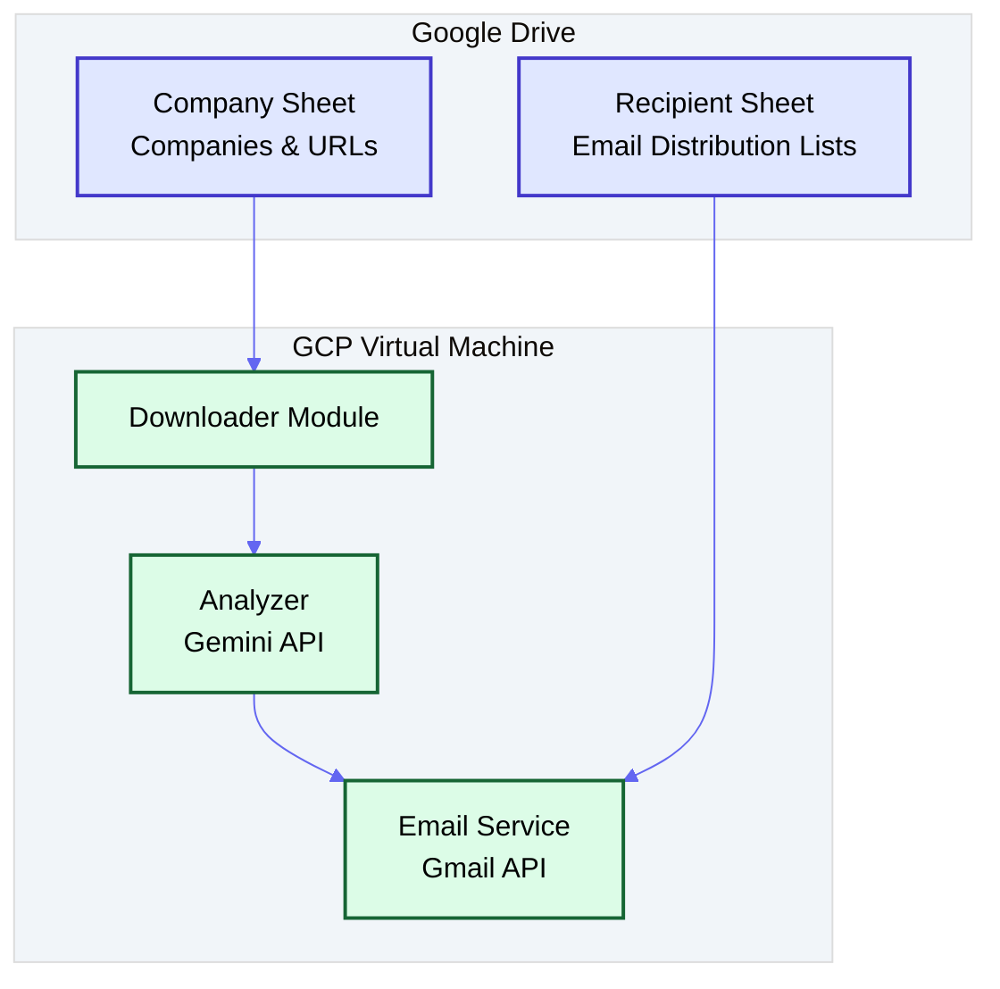
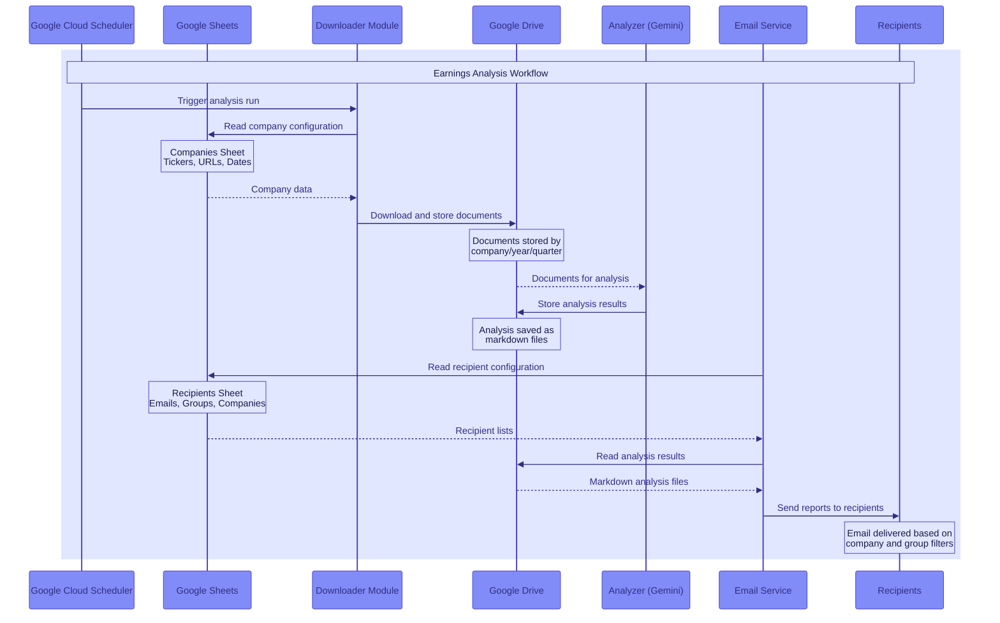

# Earnings Analysis System for Google Cloud Insights

A specialized system to analyze earnings call transcripts and financial reports from major tech companies using Google's Gemini API. The system focuses specifically on extracting Google Cloud Platform (GCP) relevant insights for executive decision-making, with capabilities to send analysis via email.

## Features

- Downloads earnings documents from verified authoritative sources and stores them in Google Drive
- Configurable company list and document URLs managed through Google Sheets
- Email recipient management through Google Sheets for easy updates without code changes
- Analyzes documents using Google Gemini 2.5 Pro with GCP-focused prompting
- Extracts competitor intelligence and strategic implications for Google Cloud
- Saves analysis in executive-friendly Markdown format
- Email delivery of analysis reports directly to stakeholders
- Simple command-line interface

## System Architecture



### Data Flow



The system follows a modular architecture with the following components:

### 1. Configuration System (Google Sheets)
- **Company Configuration Sheet**: Maintains the list of companies to track, their document URLs, and release schedules
- **Recipient Configuration Sheet**: Manages email distribution lists, with support for targeting specific companies and recipient groups
- All configuration is managed externally through Google Sheets, allowing non-technical users to update settings

### 2. Document Downloader
- Reads company configuration from Google Sheets
- Downloads documents based on configured URLs
- Stores documents directly in Google Drive (not local storage)
- Can be triggered automatically by Google Cloud Scheduler

### 3. Document Analyzer
- Retrieves documents from Google Drive
- Analyzes documents using Google's Gemini API with GCP-focused prompting
- Extracts insights relevant to Google Cloud Platform strategy
- Stores analysis results back to Google Drive

### 4. Email Service
- Reads recipient configuration from Google Sheets
- Retrieves analysis results from Google Drive
- Formats analysis for email delivery
- Sends targeted emails based on company-specific distribution rules
- Supports HTML and plain text formatting

## Setup

### 1. Clone the repository and install dependencies

```bash
pip install -r requirements.txt
```

### 2. Configure environment variables

Edit the `.env` file with your Google Gemini API key and other settings:

```
GEMINI_API_KEY=your-api-key-here
GOOGLE_DRIVE_FOLDER_ID=your-drive-folder-id-here
COMPANY_SHEET_ID=your-google-sheet-id-here
RECIPIENT_SHEET_ID=your-recipient-sheet-id-here
GMAIL_CREDENTIALS_PATH=/path/to/your/credentials.json
```

### 3. Setup Gmail API (for email functionality)

Follow these step-by-step instructions to set up Gmail API access for sending emails:

#### Step 1: Create a Google Cloud Project
1. Go to the [Google Cloud Console](https://console.cloud.google.com/)
2. In the top-right corner, click on your profile and make sure you're using the Google account you want to use for sending emails
3. Click on the project dropdown menu at the top of the page (next to "Google Cloud")
4. Click on "New Project" in the upper-right corner of the window that appears
5. Enter a name for your project (e.g., "GCP Impact Analysis")
6. Click "Create"
7. Wait for the project to be created (you'll be notified when it's ready)
8. Make sure your new project is selected in the dropdown at the top of the page

#### Step 2: Enable the Required APIs
1. In the left navigation menu, hover over "APIs & Services" and click "Library"
2. Search for and enable the following APIs:
   - Gmail API
   - Google Drive API
   - Google Sheets API
   - Cloud Scheduler API (if using automated scheduling)

#### Step 3: Configure OAuth Consent Screen
1. In the left navigation menu, click on "APIs & Services" > "OAuth consent screen"
2. Select "External" as the user type (unless you're in a Google Workspace organization, then you can select "Internal")
3. Click "Create"
4. Fill in the required fields:
   - App name: "GCP Impact Analysis"
   - User support email: Your email address
   - Developer contact information: Your email address
5. Click "Save and Continue"
6. On the "Scopes" page, click "Add or Remove Scopes"
7. Add the following scopes:
   - https://mail.google.com/ (Gmail API - Full Access)
   - https://www.googleapis.com/auth/drive (Google Drive API)
   - https://www.googleapis.com/auth/spreadsheets (Google Sheets API)
8. Click "Update"
9. Click "Save and Continue"
10. On the "Test users" section:
    - Click "Add Users"
    - Enter your email address (the one you'll use to send emails)
    - Click "Add"
11. Click "Save and Continue"
12. Review the summary and click "Back to Dashboard"

#### Step 4: Create OAuth Client ID
1. In the left navigation menu, click on "APIs & Services" > "Credentials"
2. Click the "+ Create Credentials" button at the top of the page
3. Select "OAuth client ID" from the dropdown
4. Under "Application type," select "Desktop app"
5. Name: "GCP Impact Analysis Email Client"
6. Click "Create"
7. A popup will appear with your client ID and client secret
8. Click "Download JSON" to download your credentials file
9. Save this file to a secure location (you'll reference this in your `.env` file)

### 4. Set Up Google Sheets for Configuration

#### Company Configuration Sheet
1. Create a new Google Sheet
2. Format it with these columns:
   - Ticker: Company ticker symbol (e.g., AMZN, GOOGL)
   - Name: Company name
   - IR Site: Investor relations site URL
   - Year: Release year (e.g., 2025, FY25)
   - Quarter: Release quarter (e.g., Q1, Q2)
   - Release Date: Date of earnings release
   - Release Time: Time of earnings release
   - Earnings URL: URL to earnings release document
   - Transcript URL: URL to call transcript document
   - Status: Status of analysis (e.g., Pending, Complete)
3. Share the sheet with the service account email

#### Recipient Configuration Sheet
1. Create a new Google Sheet
2. Format it with these columns:
   - Email: Recipient email address
   - Type: TO or CC
   - Active: YES or NO (to enable/disable without deletion)
   - Companies: Comma-separated list of tickers or "ALL"
   - Groups: Comma-separated list of groups (e.g., EXEC, CLOUD, COMPETITOR)
   - Notes: Documentation about the recipient
3. Share the sheet with the service account email

## Deployment on Google Cloud Platform

### Prerequisites
- Google Cloud Platform account with billing enabled
- Project created with necessary APIs enabled (Gmail API, Google Drive API, Google Sheets API)
- Google Sheets set up for company and recipient configuration
- Google Drive folder created for document storage

### Step 1: Create a Compute Engine VM Instance

1. Navigate to the [Google Cloud Console](https://console.cloud.google.com/)
2. Select your project
3. Go to Compute Engine > VM Instances
4. Click "Create Instance"
5. Configure your VM:
   - Name: `earnings-analysis-vm`
   - Machine type: e2-medium (2 vCPU, 4 GB memory) or larger based on your needs
   - Boot disk: Debian 11 or Ubuntu 20.04 LTS
   - Allow HTTP/HTTPS traffic if needed for future web interface
6. Click "Create"

### Step 2: SSH into Your VM and Install Dependencies

```bash
# Install required packages
sudo apt-get update
sudo apt-get install -y python3-pip git python3-venv

# Clone repository
git clone https://github.com/yourusername/earnings-analysis.git
cd earnings-analysis

# Create virtual environment
python3 -m venv venv
source venv/bin/activate

# Install dependencies
pip install -r requirements.txt
```

### Step 3: Configure Environment

1. Create `.env` file:
```bash
nano .env
```

2. Add configuration:
```
GEMINI_API_KEY=your-api-key-here
GOOGLE_DRIVE_FOLDER_ID=your-drive-folder-id-here
COMPANY_SHEET_ID=your-google-sheet-id-here
RECIPIENT_SHEET_ID=your-recipient-sheet-id-here
GMAIL_CREDENTIALS_PATH=/home/username/earnings-analysis/credentials.json
```

### Step 4: Upload Credentials

1. Use `gcloud` to copy credentials.json to your VM:
```bash
gcloud compute scp credentials.json earnings-analysis-vm:~/earnings-analysis/
```

2. Or create it directly on the VM (copy contents from your local file)

### Step 5: Setup Email Authentication

When running on a VM without GUI, you need a slightly different OAuth flow:

1. Install Google Cloud SDK on your local machine
2. Run `gcloud auth login` to authenticate
3. Generate OAuth tokens locally and then upload them to your VM
4. Or use the `--no-browser` flag:
```bash
python send_email.py --reauth --no-browser
```
This will provide a URL to visit in your browser, where you'll complete authentication and get a verification code to enter in the terminal.

### Step 6: Set Up Scheduled Runs with Cloud Scheduler

1. Go to Google Cloud Console > Cloud Scheduler
2. Click "Create Job"
3. Configure the job:
   - Name: `earnings-analysis-daily`
   - Frequency: `0 8 * * *` (runs at 8 AM daily)
   - Timezone: Your preferred timezone
   - Target: HTTP
   - URL: The URL to your VM instance or Cloud Function
   - HTTP Method: POST
   - Body: `{"action": "run_analysis"}`
4. Click "Create"

## Google Sheets Configuration Details

### Company Configuration Sheet

The company sheet should have the following structure:

| Ticker | Name | IR Site | Year | Quarter | Release Date | Release Time | Earnings URL | Transcript URL | Status |
|--------|------|---------|------|---------|--------------|--------------|--------------|----------------|--------|
| AMZN | Amazon.com, Inc. | https://ir.amazon.com | 2025 | Q1 | 2025-05-01 | 16:00 ET | https://ir.amazon.com/earnings.pdf | https://ir.amazon.com/transcript.pdf | Pending |
| MSFT | Microsoft Corporation | https://microsoft.com/investor | FY25 | Q3 | 2025-04-30 | 16:30 ET | https://microsoft.com/earnings.pdf | | Complete |
| GOOGL | Alphabet Inc. | https://abc.xyz/investor | 2025 | Q1 | 2025-04-28 | 16:00 ET | https://abc.xyz/earnings.pdf | https://abc.xyz/transcript.pdf | Running |

This structure allows for:
- Managing all companies in a single central location
- Tracking document URLs for automated download
- Recording release dates and times for scheduling
- Monitoring analysis status for each company's earnings

### Email Recipient Sheet

The recipient configuration will be managed through a sheet with the following structure:

| Recipient Email       | Type   | Active | Companies     | Groups       | Notes                      |
|-----------------------|--------|--------|---------------|--------------|----------------------------|
| user1@example.com     | TO     | YES    | AMZN,MSFT,ALL | EXEC,CLOUD   | Primary cloud stakeholder  |
| user2@example.com     | CC     | YES    | ALL           | EXEC         | VP needs all reports       |
| team@example.com      | TO     | YES    | GOOGL,META    | COMPETITOR   | Competitor analysis team   |
| user3@example.com     | TO     | NO     | AMZN,MSFT     | CLOUD        | Currently on vacation      |

This structure allows for:
- Flexible recipient management without code deployments
- Targeted distribution based on company
- Group-based permissions
- Temporarily disabling recipients
- Documentation of recipient purposes

## Usage

### Analyzing Latest Earnings by Ticker

```bash
python main.py --ticker AMZN
```

This will automatically:
1. Read company configuration from Google Sheets
2. Download the latest earnings documents for Amazon
3. Store them in Google Drive
4. Analyze them using Gemini API with a focus on GCP strategic implications
5. Save the results in executive-friendly Markdown format in Google Drive
6. Read recipient configuration from Google Sheets
7. Send the analysis by email to the appropriate recipients

### Using a Custom URL

If you want to analyze a specific earnings document that's not in the Google Sheet:

```bash
python main.py --custom-url "https://example.com/earnings.pdf" --file-type earnings_release
```

### Listing Available Companies

```bash
python main.py --list-companies
```

### Sending Emails for Existing Reports

To send emails for reports that have already been generated, use the `send_email.py` utility:

```bash
# List available reports
python send_email.py --list-reports

# Send email for the latest report of a specific company
python send_email.py --latest TICKER

# Send email for a specific report
python send_email.py path/to/report.md

# Force reauthentication when sending
python send_email.py --latest TICKER --force-reauth

# Force reauthentication without sending an email
python send_email.py --reauth

# Test if your credentials file is valid
python send_email.py --test-credentials
```

### Command-Line Options

- `--ticker`: Company ticker symbol to analyze (e.g., AMZN, GOOGL, META)
- `--list-companies`: List all available companies from Google Sheets
- `--custom-url`: Analyze a custom URL not in the Google Sheet
- `--file-type`: Type of file for custom URL (transcript or earnings_release)
- `--update-sheet`: Update the Google Sheet with latest document URLs

## Available Companies

The system includes configuration in Google Sheets for the following companies:

| Ticker | Company Name                         |
|--------|-------------------------------------|
| AMZN   | Amazon.com, Inc.                    |
| MSFT   | Microsoft Corporation               |
| META   | Meta Platforms, Inc.                |
| AMD    | Advanced Micro Devices, Inc.        |
| IBM    | International Business Machines Corp.|
| ORCL   | Oracle Corporation                  |
| BABA   | Alibaba Group                       |
| CRM    | Salesforce.com, Inc.                |
| SAP    | SAP SE                              |
| GOOGL  | Alphabet Inc. (Google)              |

## Email Authentication

The first time you use the email functionality, it will:

1. Open a browser window
2. Ask you to sign in to your Google account
3. Request permission to send emails
4. Redirect back to the application

After authenticating, your credentials will be saved so you don't need to authenticate again unless:
- The token expires
- You change the required scopes
- You explicitly request reauthentication using `--force-reauth` or `--reauth`

## Executive-Friendly Output

The system produces Markdown files specifically formatted for executive consumption. Each analysis includes:

1. **Header**: GCP impact focus, company name, ticker, and earnings period
2. **Executive Summary**: Quick overview of the analysis purpose
3. **Source Information**: Link to the original document and earnings date
4. **Analysis Content**: Structured Gemini analysis with GCP focus areas:
   - Financial Overview
   - Cloud Strategy and Competitive Position
   - Direct GCP Impacts
   - Indirect GCP Impacts
   - Customer and Partner Intelligence
   - Strategic Implications for GCP
5. **Footer**: Timestamp and disclaimer

Sample executive-friendly output structure:

```markdown
# GCP Impact Analysis: Amazon.com, Inc. (AMZN) - Q1 2025

> **EXECUTIVE SUMMARY**  
> This analysis examines Amazon's Q1 2025 earnings release with focus on implications for Google Cloud Platform's strategy and competitive position.
> Review the Strategic Implications section for recommended actions.

**Source:** [Earnings Release](https://ir.aboutamazon.com/files/doc_financials/2025/q1/AMZN-Q1-2025-Earnings-Release.pdf)  
**Earnings Date:** May 2, 2025  

## Financial Overview
...

## Cloud Strategy and Competitive Position
...

## Direct GCP Impacts
...

## Indirect GCP Impacts
...

## Customer and Partner Intelligence
...

## Strategic Implications for GCP
...

---
*Analysis generated on 2025-05-07 00:13:45 using Gemini 2.5 Pro*  
*This is an AI-generated analysis for Google Cloud executive team consumption only. Verify all information before making strategic decisions.*
```

## Troubleshooting

### Google Sheets and Drive Integration Issues

#### "Insufficient Permission" Errors
- Ensure the service account has correct access to the Google Sheets
- Check that the Drive folder has been shared with the service account
- Verify that the correct scopes were requested during OAuth flow

#### "Sheet Not Found" Errors
- Confirm the Sheet ID in your configuration is correct
- Check that the sheet exists and hasn't been renamed or moved

### Email Authentication Issues

#### "Request had insufficient authentication scopes"

If you see this error, you need to force reauthentication:

```bash
python send_email.py --reauth
```

This will delete the existing token and create a new one with the correct scopes.

#### "Credentials file not found"

Check that:
1. The path in your `.env` file is correct
2. The credentials file exists at that location
3. The file is a valid OAuth client ID JSON file from Google Cloud Console

#### "Error during OAuth flow"

If you encounter errors during the authentication process:
1. Ensure your Google account has not revoked access to the application
2. Check that you've completed all steps in the OAuth consent screen configuration
3. Verify that you've added yourself as a test user in the OAuth consent screen

#### Email Sending Fails

Check that:
1. Your internet connection is working
2. The email configuration in Google Sheets is correct
3. The Gmail API is enabled in your Google Cloud project
4. You have granted the necessary permissions during the OAuth flow
5. Your OAuth token hasn't expired (use `--force-reauth` if needed)

### GCP-Specific Issues

#### VM Authentication Issues
If you encounter authentication issues when running on a GCP VM:

1. Make sure the VM has the correct service account attached
2. Verify that the service account has the necessary permissions
3. For headless OAuth flows, use the `--no-browser` flag and follow the URL instructions

#### Resources Exhausted
If your VM runs out of resources:

1. Check your VM's CPU and memory usage with `top` or `htop`
2. Consider upgrading to a larger machine type
3. For memory issues with Gemini API, try processing documents in smaller chunks

## Future Enhancements

- Automated competitive tracking across cloud providers
- Historical trend analysis of cloud mentions across quarters
- Sentiment analysis on GCP references
- Auto-generated executive summaries of multiple earnings
- Dashboard integration for visualizing earnings insights
- API interface to allow other services to request analyses 

## No-Code Deployment Guide for Google Cloud

This section provides a step-by-step deployment guide for users with no coding experience who want to run the Earnings Analysis System on Google Cloud.

### Prerequisites

- Google Cloud Platform account with billing enabled
- Gmail account for sending emails
- Basic understanding of Google Cloud Console navigation

### Step 1: Deploy Using Cloud Marketplace (Recommended)

The easiest way to deploy this service is through the Google Cloud Marketplace:

1. Log in to the [Google Cloud Console](https://console.cloud.google.com/)
2. Go to "Marketplace" in the left navigation menu
3. Search for "Earnings Analysis System" 
4. Click on the listing and then click "Launch"
5. Follow the on-screen instructions for configuration
6. The deployment will automatically create all necessary resources

### Step 2: Configure Google Sheets

After deployment, you'll need to set up your configuration sheets:

1. Open the welcome email sent to your account
2. Click on the template links for "Company Configuration" and "Recipient Configuration"
3. Make a copy of these templates to your own Google Drive
4. Share both sheets with the service account email address provided in the welcome email
5. Note the Google Sheet IDs (the long string of characters in the URL) for the next step

### Step 3: Configure the Application

1. Return to Google Cloud Console
2. Go to "Compute Engine" > "VM Instances"
3. Find the instance named "earnings-analysis-vm"
4. Click the "SSH" button next to the instance to open a browser-based terminal
5. A setup wizard will automatically start. If not, type `./setup_wizard.sh` and press Enter
6. Follow the prompts to enter:
   - Your Gemini API key (available from [Google AI Studio](https://makersuite.google.com/app/apikey))
   - Your Google Sheets IDs (from Step 2)
   - Your Google Drive folder ID (from the welcome email)
7. The wizard will verify your configuration and restart the service

### Step 4: Test the System

1. From the SSH terminal, type:
   ```
   ./run_test.sh
   ```
2. This will perform a test run on an example company
3. You'll be prompted to authenticate with your Gmail account
4. Follow the on-screen instructions to complete authentication
5. Verify that a test email is received

### Step 5: Set Up Scheduled Runs Without Coding

1. Go to Google Cloud Console
2. Navigate to "Cloud Scheduler" in the left menu
3. Click "Create Job" 
4. Fill in the form using these settings:
   - Name: `earnings-analysis-daily`
   - Region: Select the same region as your VM
   - Frequency: `0 8 * * *` (runs at 8 AM daily)
   - Timezone: Your preferred timezone
   - Target type: HTTP
   - URL: (Pre-filled from your deployment)
   - HTTP Method: POST
   - Body: `{"action": "run_analysis"}`
   - Auth header: (Pre-filled from your deployment)
5. Click "Create"

### Step 6: Manage Your System

#### Using the Web Admin Panel

1. Go to Google Cloud Console > Compute Engine > VM Instances
2. Find the "External IP" address for your earnings-analysis-vm
3. Open a new browser tab and enter: `http://[YOUR-EXTERNAL-IP]:8080`
4. Log in using the credentials from your welcome email
5. From the admin panel, you can:
   - Run analysis for specific companies
   - View past analysis reports
   - Download reports as PDF or Markdown
   - Update configuration settings
   - View system logs and status

#### Managing Email Recipients

1. Open your Recipient Configuration Google Sheet
2. Add, modify, or remove recipients as needed
3. Changes take effect immediately - no restart required

#### Adding New Companies to Track

1. Open your Company Configuration Google Sheet
2. Add new rows with company information
3. New companies will be included in the next scheduled run

### Step 7: Troubleshooting With No Coding Required

#### Analysis Not Running

1. Go to the web admin panel (Step 6)
2. Click "System Status" tab
3. Check for any error messages
4. Click "Run Diagnostics" for automated troubleshooting
5. If issues persist, use the "Contact Support" button

#### Email Delivery Issues

1. In the web admin panel, go to "Email Settings"
2. Click "Test Email Configuration"
3. If the test fails, click "Re-authenticate Email"
4. Follow the on-screen instructions to re-authenticate your Gmail account

#### Viewing Logs Without Terminal Access

1. In Google Cloud Console, go to "Logging" > "Logs Explorer"
2. In the query box, enter: `resource.type="gce_instance" AND resource.labels.instance_id="earnings-analysis-vm"`
3. Click "Run Query"
4. The logs will show you what's happening with your system

### Cost Management

1. Go to Google Cloud Console > "Billing" > "Cost Management"
2. Set up a budget alert to monitor your costs
3. The typical cost for running this service is approximately $25-50/month, depending on usage 