# Earnings Analysis System for Partner S&O

A specialized web application to analyze earnings call transcripts and financial reports from major tech companies using Google's Gemini API. The system focuses on extracting business insights and competitive intelligence for strategic decision-making, with capabilities to send analysis via email.

## Features

- **Web Dashboard**: Easy-to-use browser interface for managing and running analyses
- **Document Download**: Automatically downloads earnings documents from configured URLs
- **AI Analysis**: Analyzes documents using Google Gemini API with customizable prompts
- **Email Integration**: Send analysis reports directly to stakeholders via Gmail
- **Multi-Company Support**: Analyze single companies or run comparative analysis across multiple companies
- **Local Storage**: All documents and results stored locally on your server
- **Configuration Management**: Simple JSON-based configuration for companies, emails, and prompts

## System Architecture

The Earnings Analysis System is a simple web application that runs on Google Cloud Platform and uses AI to analyze company earnings documents.

### System Overview

```mermaid
graph TB
    %% Users and Access
    USER[👤 Business Users<br/>Web Browser]
    
    %% Core System Components
    subgraph GCP["☁️ Google Cloud Platform - VM Instance"]
        WEB[🌐 Flask Web Server<br/>Dashboard & API]
        DOWN[📥 Downloader<br/>Get Documents]
        ANALYZE[🤖 Analyzer<br/>Process with AI]
        EMAIL[📧 Email Service<br/>Send Reports]
        STORAGE[(💾 Local Storage<br/>Documents & Results)]
    end
    
    %% External APIs
    GEMINI[🧠 Gemini API<br/>AI Analysis]
    GMAIL[📧 Gmail API<br/>Send Emails]
    DOCS[🌍 Company Websites<br/>Earnings Documents]
    
    %% Configuration and Output
    CONFIG[⚙️ Configuration<br/>• Email Recipients<br/>• Prompt Templates<br/>• Company Settings]
    STAKEHOLDERS[📬 Business Stakeholders<br/>Email Reports]
    
    %% Main Flow Connections
    USER --> WEB
    WEB --> DOWN
    WEB --> ANALYZE
    WEB --> EMAIL
    WEB --> CONFIG
    
    %% Storage Connections
    DOWN --> STORAGE
    ANALYZE --> STORAGE
    EMAIL --> STORAGE
    
    %% External API Connections
    DOWN -.->|Download| DOCS
    ANALYZE -.->|AI Processing| GEMINI
    EMAIL -.->|OAuth & Send| GMAIL
    
    %% Output Connection
    EMAIL --> STAKEHOLDERS
    
    %% Positioning for compact layout
    USER ~~~ GEMINI
    GEMINI ~~~ GMAIL
    GMAIL ~~~ DOCS
    CONFIG ~~~ STAKEHOLDERS
    
    %% Styling
    classDef userClass fill:#4A90E2,stroke:#2E5C8A,stroke-width:3px,color:#FFFFFF
    classDef gcpClass fill:#FFB84D,stroke:#CC8F00,stroke-width:2px,color:#FFFFFF
    classDef storageClass fill:#7ED321,stroke:#5AA016,stroke-width:2px,color:#FFFFFF
    classDef apiClass fill:#F5A623,stroke:#C4841D,stroke-width:2px,color:#FFFFFF
    classDef configClass fill:#9013FE,stroke:#6200EA,stroke-width:2px,color:#FFFFFF
    classDef outputClass fill:#50E3C2,stroke:#00BFA5,stroke-width:2px,color:#FFFFFF
    
    class USER userClass
    class WEB,DOWN,ANALYZE,EMAIL gcpClass
    class STORAGE storageClass
    class GEMINI,GMAIL,DOCS apiClass
    class CONFIG configClass
    class STAKEHOLDERS outputClass
```



### How It Works

The system is designed to be simple and straightforward - everything runs on a single Google Cloud VM with just a few core components working together.

#### ☁️ **Google Cloud Platform - VM Instance**
Your entire application lives on one virtual machine in Google Cloud. This makes it:
- **Easy to manage**: Everything is in one place
- **Cost-effective**: No need for multiple servers or complex infrastructure  
- **Secure**: Protected by Google Cloud's built-in security

#### 🌐 **Flask Web Server**
The heart of your system - a simple web application that provides:
- **Dashboard Interface**: Click-and-go operations, no command line needed
- **Real-time Updates**: See progress as your analysis runs
- **Configuration Management**: Change settings through simple web forms
- **Report Viewing**: Browse and share analysis results instantly

#### 📦 **Core Components Working Together**

**📥 Downloader**
- Automatically fetches earnings documents from company websites
- Handles different file types (PDFs, web pages, documents)
- Saves everything locally so you don't lose data

**🤖 Analyzer**  
- Sends your documents to Google's AI (Gemini) for smart analysis
- Uses customizable prompts to focus on what matters to your business
- Generates professional reports ready for executives

**📧 Email Service**
- Connects securely to Gmail to send reports
- Formats emails professionally with your analysis
- Manages your recipient lists automatically

**💾 Local Storage**
- Keeps all your documents organized by company and date
- Stores analysis results for easy access later
- Maintains configuration files for your settings

#### 🔗 **External Connections (Just 3 Simple APIs)**

**🧠 Gemini API**: Google's AI does the heavy lifting of analyzing documents and extracting business insights

**📧 Gmail API**: Securely sends your analysis reports to stakeholders without you having to copy/paste

**🌍 Company Websites**: Automatically downloads the latest earnings documents so you don't have to hunt for them

#### ⚙️ **Configuration Made Simple**
Everything is configured through easy-to-edit settings:
- **Email Recipients**: Who gets which reports
- **Prompt Templates**: What questions the AI asks when analyzing
- **Company Settings**: Which companies to track and where to find their documents

#### 📬 **Automatic Delivery**
Once everything is set up, the system runs on autopilot:
1. Downloads new earnings documents
2. Analyzes them with AI
3. Sends professional reports to your team
4. Stores everything for future reference

### Why This Design is Simple Yet Powerful

- **Single VM**: No complex cloud architecture to manage
- **Web Interface**: No technical skills needed for daily use
- **Automated Workflow**: Set it up once, runs automatically
- **Local Storage**: No dependency on external databases or file systems
- **Three APIs Only**: Minimal external dependencies (Gemini + Gmail + company websites)
- **Self-Contained**: Everything you need is in one place

## Quick Setup

### 1. Deploy to Google Cloud VM

```bash
# Connect to your GCP VM instance
gcloud compute ssh your-instance-name

# Clone the repository
git clone https://github.com/yourusername/earnings-analysis.git
cd earnings-analysis

# Install dependencies
pip install -r requirements.txt
```

### 2. Configure API Keys

Create a `.env` file with your API credentials:

```bash
nano .env
```

Add your API keys:
```
GEMINI_API_KEY=your-gemini-api-key-here
GMAIL_CLIENT_ID=your-gmail-client-id
GMAIL_CLIENT_SECRET=your-gmail-client-secret
```

### 3. Start the Application

```bash
# Start the web server
python app.py
```

### 4. Access the Web Interface

Open your browser and navigate to:
```
http://[your-vm-external-ip]:8080
```

### 5. Configure and Run Analysis

1. **Company Configuration**: Add companies and their earnings document URLs
2. **Email Configuration**: Set up recipients for analysis reports  
3. **Run Analysis**: Select companies and start AI-powered analysis
4. **View Results**: Browse generated reports and send via email

## File Structure

```
gemini_agent/
├── app.py                 # Main Flask web application
├── main.py               # Command-line interface (alternative to web)
├── send_email.py         # Email utility script
├── config.py             # Configuration and paths
├── config_manager.py     # Configuration management
├── downloader.py         # Document downloader
├── analyzer.py           # Gemini AI analyzer
├── email_service.py      # Email service
├── requirements.txt      # Python dependencies
├── .env                  # Environment variables (create this)
├── config/               # Configuration files
│   ├── company_config.json    # Company and earnings data
│   ├── email_config.json      # Email recipients and settings
│   └── prompt_config.txt      # Custom analysis prompt
├── downloads/            # Downloaded documents (auto-created)
│   └── ticker/
│       └── year_quarter/
├── results/              # Analysis results (auto-created)
├── templates/            # Web interface templates
├── static/              # CSS and web assets
└── token.pickle         # Gmail authentication token (auto-created)
```

## Using the Command Line (Alternative)

For advanced users, you can also run analyses from the command line:

### Analyze a Single Company

```bash
# Analyze the latest earnings for Amazon
python main.py --ticker AMZN

# List all configured companies
python main.py --list-companies
```

### Email Management

```bash
# List all available analysis reports
python send_email.py --list-reports

# Send email for the latest report of a specific company
python send_email.py --latest AMZN

# Send email for a specific report file
python send_email.py results/AMZN_2025_Q1_20250507_123456.md
```

### Check Downloaded Files

```bash
# View downloaded documents
ls -la downloads/

# View results
ls -la results/

# View a specific company's downloads
ls -la downloads/amzn/
```

## Configuration

### Company Configuration (`config/company_config.json`)

This file contains all the companies you want to track and their earnings document URLs:

```json
{
  "companies": {
    "amzn": {
      "name": "Amazon.com, Inc.",
      "ticker": "AMZN",
      "ir_site": "https://ir.aboutamazon.com",
      "releases": {
        "2025": {
          "Q1": {
            "date": "May 2, 2025",
            "time": "after-market close",
            "earnings_release": "https://example.com/earnings.pdf",
            "call_transcript": "https://example.com/transcript.pdf"
          }
        }
      }
    }
  }
}
```

### Email Configuration (`config/email_config.json`)

Configure who receives the analysis reports:

```json
{
  "enabled": true,
  "recipients": ["user@example.com"],
  "cc": ["manager@example.com"],
  "credentials_path": ".env:GMAIL_CREDENTIALS_PATH",
  "token_path": "token.pickle",
  "email_subject_prefix": "Earnings Analysis: ",
  "html_enabled": true
}
```

### Prompt Configuration (`config/prompt_config.txt`)

Customize how Gemini analyzes the documents. The prompt supports variables:
- `{company_name}` - Company name
- `{quarter}` - Quarter (e.g., Q1)
- `{year}` - Year (e.g., 2025)

## Gmail Authentication Setup

### First-Time Email Setup

1. **Create Google Cloud Project** (if not already done):
   - Go to [Google Cloud Console](https://console.cloud.google.com/)
   - Create a new project or select existing
   - Enable Gmail API

2. **Create OAuth Credentials**:
   - Go to APIs & Services > Credentials
   - Create OAuth 2.0 Client ID
   - Download the JSON file as `credentials.json`

3. **Upload Credentials to VM**:
   ```bash
   # From your local machine
   gcloud compute scp credentials.json your-instance-name:~/gemini_agent/config/
   ```

4. **Authenticate on VM** (with port forwarding):
   ```bash
   # Connect with port forwarding
   gcloud compute ssh your-instance-name -- -L 8080:localhost:8080
   
   # On the VM, run authentication
   python send_email.py --reauth
   
   # Open the displayed URL in your local browser to complete authentication
   ```

## Troubleshooting

### Cannot Access Web Interface

1. **Check if application is running**:
   ```bash
   ps aux | grep python
   ```

2. **Check VM firewall** (allow HTTP traffic):
   ```bash
   gcloud compute firewall-rules create allow-flask-app \
     --allow tcp:8080 \
     --source-ranges 0.0.0.0/0 \
     --description "Allow Flask app"
   ```

3. **Restart the application**:
   ```bash
   cd gemini_agent
   python app.py
   ```

### Permission Errors

If you see "Read-only file system" errors:

1. **Check current directory permissions**:
   ```bash
   ls -la
   ```

2. **Create writable directories**:
   ```bash
   mkdir -p downloads results config
   chmod 755 downloads results config
   ```

3. **Set custom storage paths** in `.env`:
   ```
   LOCAL_STORAGE_PATH=/home/username/storage/downloads
   RESULTS_DIR=/home/username/storage/results
   ```

### No Companies Found

1. **Check company configuration**:
   ```bash
   cat config/company_config.json
   ```

2. **Create initial configuration** via web interface:
   - Go to http://[your-vm-ip]:8080/config/company
   - Add your company data
   - Save configuration

### Document Download Issues

1. **Check downloads folder**:
   ```bash
   ls -la downloads/
   ```

2. **View download logs**:
   ```bash
   python main.py --ticker AMZN --verbose
   ```

3. **Test URL accessibility**:
   ```bash
   curl -I "https://example.com/earnings.pdf"
   ```

## Supported Companies

The system can be configured for any company with publicly available earnings documents. Example companies included:

- Amazon (AMZN)
- Microsoft (MSFT)
- Meta (META)
- AMD (AMD)
- Google/Alphabet (GOOGL)

Add more companies by editing the company configuration through the web interface.

## Security Considerations

- Store API keys securely in `.env` file
- Restrict VM access using Google Cloud IAM
- Use HTTPS in production (consider setting up SSL certificates)
- Regularly update dependencies: `pip install -r requirements.txt --upgrade`

## Getting Help

1. **Check application logs** in the terminal where you started `python app.py`
2. **View configuration files** in the `config/` directory
3. **Test individual components**:
   - `python send_email.py --test-credentials` - Test email setup
   - `python main.py --list-companies` - Test company configuration
   - `curl http://localhost:8080` - Test web application

## Advanced Usage

### Running in Production

For production deployment, use Gunicorn:

```bash
# Install Gunicorn (already in requirements.txt)
pip install gunicorn

# Run with Gunicorn
gunicorn -w 4 -b 0.0.0.0:8080 app:app
```

### Automated Scheduling

Set up a cron job to run analyses automatically:

```bash
# Edit crontab
crontab -e

# Add line to run analysis daily at 9 AM
0 9 * * * cd /home/username/gemini_agent && python main.py --ticker AMZN
```

### Backup Configuration

Regularly backup your configuration:

```bash
# Create backup
tar -czf config-backup-$(date +%Y%m%d).tar.gz config/ results/

# Copy to Cloud Storage (optional)
gsutil cp config-backup-*.tar.gz gs://your-backup-bucket/
```